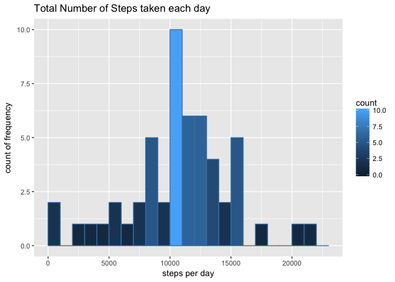
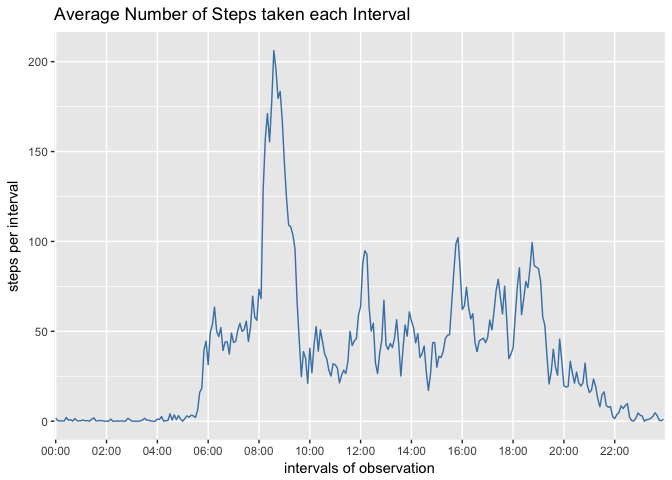
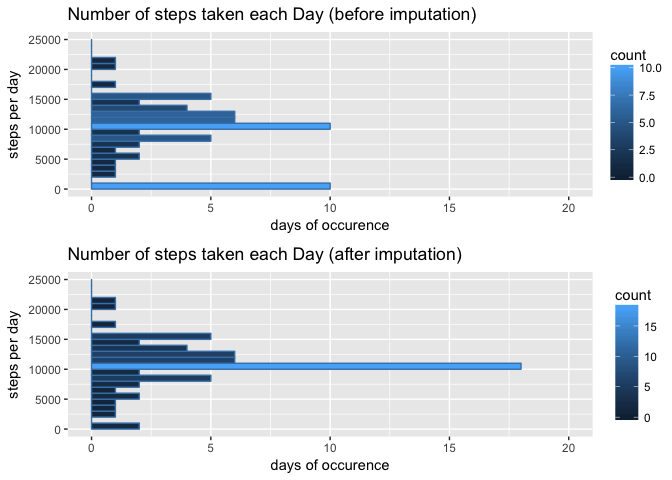
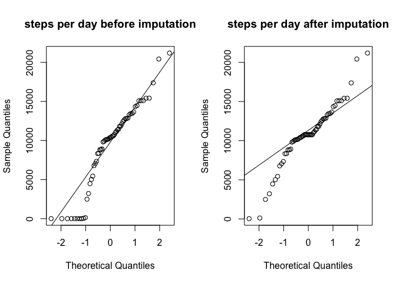
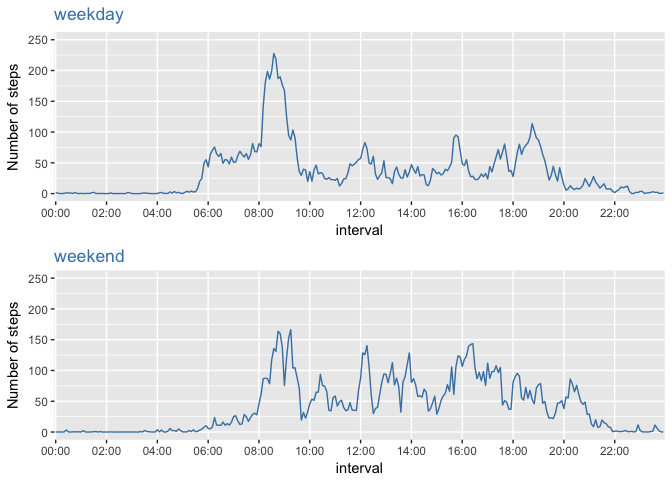

Setting environment
-------------------

Getting data
------------

### macro functions for getting data

``` r
# download and unzip file from given url
dataset.source.get_zip <- function(dataset.name, source.url, dataset.source.type=".csv", ...) {
    dataset.source.zip <-  paste(c(dataset.name, ".zip"), collapse = "")
    dataset.source <-  paste(c(dataset.name, dataset.source.type), collapse = "")
    
    if (!file.exists(dataset.source)) {
        download.file(source.url, destfile = dataset.source.zip, mode='wb')
        unzip(dataset.source.zip)
    }
    dataset.source
}

# generation of clean data from existing (downloaded and unzipped) file
dataset.get <- function(dataset.name, source.zip, dataset.source.type, ...) {
    # import data source from file
    switch(dataset.source.type, 
           ".csv" = {dataset <-  read.csv(
                                    dataset.source.get_zip(dataset.name, source.zip, dataset.source.type)
                                    , sep = ','
                                    , dec = '.'
                                    #,na.strings = 'NA'
                                    )
                    })
    dataset
}
```

### Project specific getting of data

Use of data from a personal activity monitoring device. This device collects data at 5 minute intervals through out the day. The data consists of two months of data from an anonymous individual collected during the months of October and November, 2012 and include the number of steps taken in 5 minute intervals each day.

The data source for this assignment can be downloaded from [coursera project site](https://www.coursera.org/learn/reproducible-research/peer/gYyPt/course-project-1) (downloaded on 2017-05-16)

``` r
# check, whether clean data is available, otherwise generation of data source
# csv-separated with ",", na.strings with "NA"
if (!exists("set.AMD")) {
    set.AMD <- dataset.get("activity"
                           , "https://d396qusza40orc.cloudfront.net/repdata%2Fdata%2Factivity.zip"
                           , ".csv")
} 

# data wrangling
require(lubridate)
```

    ## Loading required package: lubridate

    ## 
    ## Attaching package: 'lubridate'

    ## The following object is masked from 'package:base':
    ## 
    ##     date

``` r
set.AMD$date <- ymd(set.AMD$date)

# make time serie from double
require(stringr)
```

    ## Loading required package: stringr

``` r
set.AMD$interval <- paste(substr(str_pad(set.AMD$interval, 4, pad="0"), 1,2)
                           , substr(str_pad(set.AMD$interval, 4, pad="0"), 3,4), sep=":")
set.AMD$interval <- factor(set.AMD$interval)

rm(dataset.get, dataset.source.get_zip)
```

``` r
# check for var (steps, date, interval), types (int, date, factor) and row-count (17,568)
str(set.AMD)
# check, how many rows with missing values are present
table(is.na(set.AMD))
```

I. What is mean total number of steps taken per day?
----------------------------------------------------

### 1. histogram of the total number of steps taken each day

``` r
# aggregate steps by day
require(plyr)
```

    ## Loading required package: plyr

    ## 
    ## Attaching package: 'plyr'

    ## The following object is masked from 'package:lubridate':
    ## 
    ##     here

``` r
require(ggplot2)
```

    ## Loading required package: ggplot2

``` r
set.AMD.aggr_day <- ddply(set.AMD, c("date"), summarise, steps=sum(steps))

# histogramm of days with valid number of steps
ggplot(data=subset(set.AMD.aggr_day, !is.na(steps))
       , aes(subset(set.AMD.aggr_day, !is.na(steps))$steps)) + 
    geom_histogram(breaks=seq(0,23000, by =1000), 
                 col="steelblue", 
                 aes(fill=..count..)) +
    labs(title="Total Number of Steps taken each day") +
    labs(x="steps per day", y="count of frequency")
```



``` r
rm(set.AMD.aggr_day)
```

### 2. mean and median total number of steps taken per day

``` r
# aggregate steps by day
require(plyr)
set.AMD.aggr_day <- ddply(set.AMD, c("date"), summarise, steps=sum(steps))

# generate output table
stat_steps <- data.frame(c(mean(set.AMD.aggr_day$steps, na.rm=T)
                           , median(set.AMD.aggr_day$steps, na.rm=T)
                           ))
colnames(stat_steps) <- c("Steps per day")
rownames(stat_steps) <- c("Mean", "Median")

stat_steps
```

    ##        Steps per day
    ## Mean        10766.19
    ## Median      10765.00

``` r
rm(set.AMD.aggr_day, stat_steps)
```

II. What is the average daily activity pattern?
-----------------------------------------------

### 1. time series plot (i.e. type = "l") of the 5-minute interval (x-axis) and the average number of steps taken, averaged across all days (y-axis)

``` r
# aggregate steps by interval
require(plyr)
require(ggplot2)
set.AMD.aggr_interval <- ddply(set.AMD, c("interval"), summarise, steps=mean(steps, na.rm=T))

# line graph of interval versus avg steps
ggplot(data=set.AMD.aggr_interval
       , aes(x=interval,y=steps, group=1)) +
    geom_line(color="steelblue") +
    labs(title="Average Number of Steps taken each Interval") +
    labs(y="steps per interval", x="intervals of observation") +
    scale_x_discrete(breaks = unique(set.AMD.aggr_interval$interval)[seq(1,288,24)])
```



``` r
rm(set.AMD.aggr_interval)
```

### 2. 5-minute interval, on average across all the days in the dataset, contains the maximum number of steps

``` r
require(plyr)
set.AMD.aggr_interval <- ddply(set.AMD, c("interval"), summarise, steps=mean(steps, na.rm=T))

# generate output table
stat_steps <- set.AMD.aggr_interval[set.AMD.aggr_interval$steps==max(set.AMD.aggr_interval$steps), ]
colnames(stat_steps) <- c("at interval", "steps")
rownames(stat_steps) <- c("Maximum")

stat_steps
```

    ##         at interval    steps
    ## Maximum       08:35 206.1698

``` r
rm(set.AMD.aggr_interval, stat_steps)
```

III. Imputing missing values
----------------------------

### 1. total number of missing values in the dataset (i.e. the total number of rows with NAs)

``` r
# generate output table
stat_steps <- data.frame(nrow(set.AMD[is.na(set.AMD)==T,]))
colnames(stat_steps) <- c("total number of rows with NAs")

stat_steps
```

    ##   total number of rows with NAs
    ## 1                          2304

``` r
rm(stat_steps)
```

### 2. Devise a strategy for filling in all of the missing values in the dataset.

The strategy does not need to be sophisticated. For example, you could use the mean/median for that day, or the mean for that 5-minute interval, etc.

Missing value x<sub>n</sub> will be imputated by mean of x<sub>n-1</sub> and x<sub>n+1</sub>. In cases when x<sub>n-1</sub> and/or x<sub>n+1</sub> are not available, x<sub>n-1</sub> and/or x<sub>n+1</sub> is imputated with mean of x<sub>n-1</sub> resp. x<sub>n+1</sub> of relevant 5-minute interval. Missing value x<sub>1</sub> will be calculated with mean of x<sub>max</sub> and x<sub>2</sub>. Missing value x<sub>max</sub> will be calculated with mean of x<sub>max-1</sub> and x<sub>1</sub>.

``` r
steps_imputation <- function(df, serie_date) {
    # extract serie by given date
    vector.steps <- subset(df, df$date==serie_date, select = c(steps, interval, date))
    
    # get max pos of serie 
    pos.max <- nrow(vector.steps)

    # get predecessor or successor value and if necessary, 
    # imputate missing step value from mean of all steps in specific interval 
    step.value.neighbor <- function(pos, neighbor){
        if(neighbor==-1) {
            if(pos==1){
                pos <- pos.max # predecessor of pos 1 is last pos of vector
            } else {
                pos <- pos-1 # precessor of pos is last pos
            }
        }
        if(neighbor==1) {
            if(pos==pos.max){
                pos <- 1 # successor of last pos is first pos of vector
            } else {
                pos <- pos+1 # successor of pos is next pos
            }
        }
        # get mean of steps per interval, if predecessor or succesor are NAs
        if(is.na(vector.steps[pos,1])){
            step.value <- mean(subset(df, df$interval==vector.steps[pos,2], select = steps)[,1], na.rm=T)
        } else {
            step.value <- vector.steps[pos,1]
        }  
        step.value
    }

    # imputate missing step-value from mean of predecessor and successor value
    step.value.current <- function(pos){
        if(is.na(vector.steps[pos,1])){
            step.value <- mean(c(step.value.neighbor(pos=pos, neighbor=-1)
                               , step.value.neighbor(pos=pos, neighbor=1))
                               , na.rm=T)            
        } else {
            step.value <- vector.steps[pos,1]
        }  
        step.value
    }
    # return vector of steps with values instead of NAs
    require(plyr)
    steps.imputated <- cbind(vector.steps, ldply(seq(1,pos.max), step.value.current))

    steps.imputated
}
```

### 3. new dataset that is equal to the original dataset but with the missing data filled in

``` r
# get date series
series.date <- rownames(table(set.AMD$date))

# generation of new data set with filled data for steps
require(plyr)
set.AMD.filled <- ldply(series.date, steps_imputation, df=set.AMD)

# rename var "steps" to "steps_unfilled" and var for filled steps to "steps"
colnames(set.AMD.filled) <- c("steps_unfilled", "interval", "date", "steps")

str(set.AMD)
```

    ## 'data.frame':    17568 obs. of  3 variables:
    ##  $ steps   : int  NA NA NA NA NA NA NA NA NA NA ...
    ##  $ date    : Date, format: "2012-10-01" "2012-10-01" ...
    ##  $ interval: Factor w/ 288 levels "00:00","00:05",..: 1 2 3 4 5 6 7 8 9 10 ...

``` r
str(set.AMD.filled)
```

    ## 'data.frame':    17568 obs. of  4 variables:
    ##  $ steps_unfilled: int  NA NA NA NA NA NA NA NA NA NA ...
    ##  $ interval      : Factor w/ 288 levels "00:00","00:05",..: 1 2 3 4 5 6 7 8 9 10 ...
    ##  $ date          : Date, format: "2012-10-01" "2012-10-01" ...
    ##  $ steps         : num  0.708 0.925 0.245 0.104 1.123 ...

``` r
rm(series.date, steps_imputation)
```

### 4. histogram of the total number of steps taken each day and Calculate and report the mean and median total number of steps taken per day.

``` r
# aggregate steps by day from set with imputated, filled steps

require(plyr)
set.AMD.filled.aggr_day <- ddply(set.AMD.filled, c("date"), summarise, steps=sum(steps, na.rm=T))
set.AMD.aggr_day <- ddply(set.AMD, c("date"), summarise, steps=sum(steps, na.rm=T))

require(ggplot2)
# histogramm of total steps by day
plot.filled <- ggplot(data=set.AMD.filled.aggr_day
       , aes(steps)) + 
    geom_histogram(breaks=seq(0, 25000, by=1000), 
                 col="steelblue", 
                 aes(fill=..count..)) +
    coord_flip(ylim=c(0,20)) +
    labs(title="Number of steps taken each Day (after imputation)") +
    labs(x="steps per day", y="days of occurence")

plot.unfilled <- ggplot(data=set.AMD.aggr_day
       , aes(steps)) + 
    geom_histogram(breaks=seq(0, 25000, by=1000), 
                 col="steelblue", 
                 aes(fill=..count..)) +
    coord_flip(ylim=c(0,20)) +
    labs(title="Number of steps taken each Day (before imputation)") +
    labs(x="steps per day", y="days of occurence")

require(grid)
```

    ## Loading required package: grid

``` r
grid.newpage()
grid.draw(rbind(ggplotGrob(plot.unfilled), ggplotGrob(plot.filled), size = "last"))
```



``` r
rm(set.AMD.aggr_day, set.AMD.filled.aggr_day)
```

#### 4.a Do these values differ from the estimates from the first part of the assignment?

``` r
require(plyr)
set.AMD.filled.aggr_day <- ddply(set.AMD.filled, c("date"), summarise, steps=sum(steps, na.rm=T))
set.AMD.aggr_day <- ddply(set.AMD, c("date"), summarise, steps=sum(steps, na.rm=T))


# generate output table
stat_steps <- data.frame(c(mean(set.AMD.aggr_day$steps, na.rm=T)
                           , median(set.AMD.aggr_day$steps, na.rm=T)
                           ), 
                         c(mean(set.AMD.filled.aggr_day$steps, na.rm=T)
                           , median(set.AMD.filled.aggr_day$steps, na.rm=T)
                           ))
colnames(stat_steps) <- c("steps per day before imputation", "steps per day after imputation")
rownames(stat_steps) <- c("Mean", "Median")

stat_steps
```

    ##        steps per day before imputation steps per day after imputation
    ## Mean                           9354.23                       10766.19
    ## Median                        10395.00                       10766.19

``` r
rm(set.AMD.aggr_day, set.AMD.filled.aggr_day, stat_steps)
```

Assumption: Imputation of unfilled values of steps by using mean-function looks like steps tend to vary less from day to day.

#### 4.b What is the impact of imputing missing data on the estimates of the total daily number of steps?

``` r
require(plyr)
set.AMD.filled.aggr_day <- ddply(set.AMD.filled, c("date"), summarise, steps=sum(steps, na.rm=T))
set.AMD.aggr_day <- ddply(set.AMD, c("date"), summarise, steps=sum(steps, na.rm=T))

par(mfrow=c(1,2))
qqnorm(set.AMD.aggr_day$steps, main="steps per day before imputation")
qqline(set.AMD.aggr_day$steps)

qqnorm(set.AMD.filled.aggr_day$steps, main="steps per day after imputation")
qqline(set.AMD.filled.aggr_day$steps)
```



``` r
rm(set.AMD.aggr_day, set.AMD.filled.aggr_day, plot.filled, plot.unfilled)
```

Conclusion: Based on a residual of more than 5000 steps, total number of steps per day varies less then before imputation.

IV. differences in activity patterns between weekdays and weekends
------------------------------------------------------------------

For complete time-series, missing values are filled-in.

``` r
# generate factors of weekday and weekend via day of week
set.AMD.filled$dayofweek <- factor(weekdays(set.AMD.filled$date))
set.AMD.filled$partofweek[set.AMD.filled$dayofweek %in% levels(set.AMD.filled$dayofweek)[6:7]] <- "weekend"
set.AMD.filled$partofweek[set.AMD.filled$dayofweek %in% levels(set.AMD.filled$dayofweek)[1:5]] <- "weekday"

require(plyr)
set.AMD.filled.aggr_interval.weekday <- ddply(set.AMD.filled[set.AMD.filled$partofweek=="weekday",]
                                              , c("interval"), summarise, steps=mean(steps, na.rm=T))
set.AMD.filled.aggr_interval.weekend <- ddply(set.AMD.filled[set.AMD.filled$partofweek=="weekend",]
                                              , c("interval"), summarise, steps=mean(steps, na.rm=T))

require(ggplot2)
# line graph of interval versus avg steps
plot.weekday <- ggplot(data=set.AMD.filled.aggr_interval.weekday
       , aes(x=interval,y=steps, group=1)) +
    geom_line(color="steelblue") +
    labs(title="weekday") +
    labs(y="Number of steps") +
    theme(plot.title = element_text(colour="steelblue")) +
    scale_x_discrete(breaks = unique(set.AMD.filled.aggr_interval.weekday$interval)[seq(1,288,24)]) +
    scale_y_continuous(limits=c(0,250))

plot.weekend <- ggplot(data=set.AMD.filled.aggr_interval.weekend
       , aes(x=interval,y=steps, group=1)) +
    geom_line(color="steelblue") +
    labs(title="weekend") +
    labs(y="Number of steps") +
    theme(plot.title = element_text(colour="steelblue")) +
    scale_x_discrete(breaks = unique(set.AMD.filled.aggr_interval.weekend$interval)[seq(1,288,24)]) +
    scale_y_continuous(limits=c(0,250))

require(grid)
grid.newpage()
grid.draw(rbind(ggplotGrob(plot.weekday), ggplotGrob(plot.weekend), size = "last"))
```



``` r
rm(set.AMD.filled.aggr_interval.weekday, set.AMD.filled.aggr_interval.weekend, plot.weekday, plot.weekend)
```
